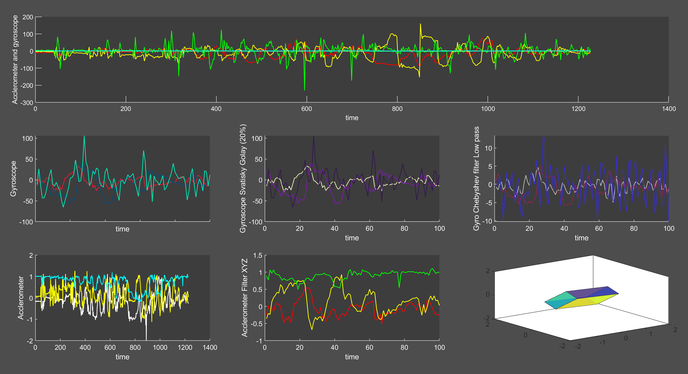

# Real-time-Accelerometer-and-Gyroscope-data-visualization-using-GY-521-module
Visualizing Gyroscope data in real-time

### Things to fix:

- Add clibration
- Add calculation to make sense out of the data
- Add filters like complementary and IMU filters to make sense of the data
- Make responsive plots
- More plots need to track the path

